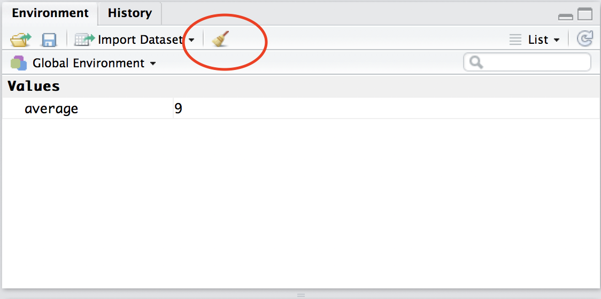
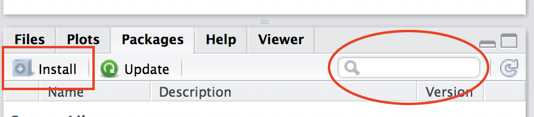
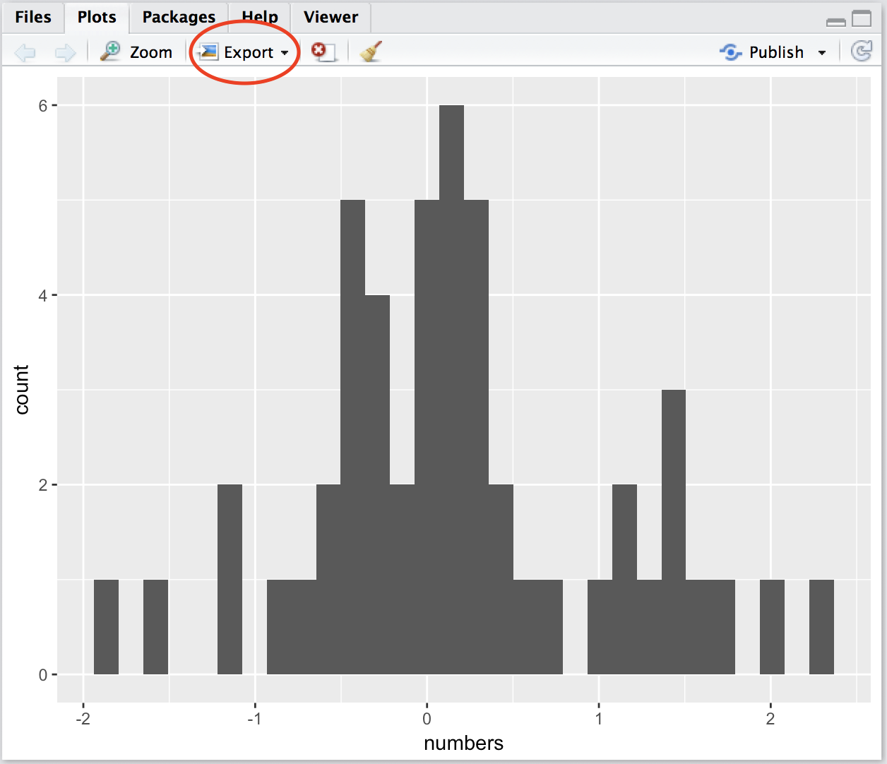

```{r setup, include=FALSE}
knitr::opts_chunk$set(echo=T, results='hide', message=FALSE, warning=FALSE)
require(tidyverse)
```

Welcome to R!

R is a language for doing statistical analysis, and RStudio is the interface where you will interact with this language. This document is designed to get you started with the programs.
But first, let's go over the format of all of the labs for this class.

# Lab protocol
Each lab will have an in-class portion, and an "On Your Own", or OYO!, section.  You will record your answers to the in-class portion in a Microsoft Word document or google doc.  Since this is Lab 1, please save this file as "Lab1Exercises" when you have completed it. *You should save this file in your Lab1 folder.*  Then, upload it to haiku.
You will record your answers to the OYO! section in another Word document.  Follow the directions in the OYO! section since sometimes you will need to upload more than one file to haiku (that's true of Lab 1).
Now, let's get back to learning R!

<!-- You should have already gotten both R and RStudio installed on your computer. If not - check with your instructor about that. -->

# The RStudio Workspace

You will notice that the workspace is divded into four windows or quadrants.  We'll look at each of these now.

## The Console window
Direct your attention to the lower left region, "Console."  You can use R as a calculator.  Try typing in the following expressions one at a time.  Press "Return" on your keyboard after you type each expression.  

1+1

3*5

4^2

Pretty neat, huh?

Okay, let's average the numbers 5, 8, and 14 by typing

(5+8+14)/3

Although this is nice if we only have a few numbers to average, it is not a practical way of finding the average of a long list of numbers.  Let's create a small list of numbers so that you can see how you might enter numbers into R.  We will use the concatenate , or command, `c`.  Type:

c(5,8,14)

You just created a list!  

Note that the concatenate function took the numbers inside the parentheses and turned them into a single list.  In general, every function will have a set of parentheses after the function name.  A function takes whatever is inside the parentheses and performs some action.  You will use functions every time you use R, and over time you will become familiar with many different functions.

Let's average these numbers.  The mean command finds the mean average of a list of numbers.  You can type mean(c(5,8,14)), but there's a faster way.  Press the up arrow.  Notice that this recalls the previous command.  Pressing the up arrow again recalls the command before this one, and so on.  Once you have recalled c(5,8,14), position your cursor appropriately so that you can modify it to

mean(c(5,8,14))

and press "Return".  Okay, you have averaged those numbers.  But what if we wanted to use that average in another calculation?  To do this, we need to store the value of this average in a variable.  We should give the variable an appropriate name, like 'average'.  We use the <- symbols to indicate that we want to store what is on the right of the symbols in the variable whose name is on the left.  For example, type

```{r, echo=TRUE}
average <- mean(c(5,8,14))
```

Now, we can use this value in another calculation.  Type

average*3

1. This gives us the sum of the three numbers we started with.  Why?

## The Environment/History window

Take a peek at the upper right region (with the tabs Environment and History).  Notice that our variable `average` is here.  Whenever you have defined variables, they and their values will show up here.  Press the 'broom' icon, and click yes.  This allows you to clear all of the variables from the Environment.  




2. Click on the History tab. What do you see?

## The Plots/Packages/Help window
R can do a lot on its own, but a lot of the power of the language comes from packages people have written to extend what R can do. In this course, we'll be using the `tidyverse` package. This will make our graphs particularly nice looking, and will add some nice data tools.

To install the package, click `Packages` at the top of the bottom right pane in RStudio. Click `Install` and then type tidyverse, then click `Install`. Get yourself a cup of coffee, it might take a while. Once it's installed, `tidyverse` will show up in the list of packages and you can click the check box next to its name to load it. IMPORTANT: You'll never need to install the tidyverse again, but you will need to load it each time you start up RStudio. You do this by just clicking the name `tidyverse` in the list of packages.  You can speed this process along by typing the name of this package in the search window.



Now go ahead and install the `infer` package.  We'll use this later in the course.

## The Editor window and R Scripts

The Console is where the R code is executed, but it is helpful only when we want R to do a few things.  Once you close the RStudio, everything you typed will be erased.  Usually, we want to be able to go back to work we've done and either run it again or re-use parts of it in the future.  To do this, we will write our commands in an R Script.

Let's make a new file in which to keep your R commands. In RStudio, click `File` then `New File` then `R Script` (or contol/command + shift + N). Every time you run a command, you can save it in this file. You'll have a record of everything you've run. If you need to re-run a command, forgot how to run something, or need to run the same analysis on a different data set, you will have easy access to your previous command.

## Running some code

R is executed by typing commands for the computer to interpret. While we'll get into some more detailed commands later in the course, let's try to have the computer execute some code. In your new file, type:

```{r}
rnorm(50)
```

First off, notice that the color of the name of your `R Script` has changed from black to <span style="color:red">red</span> which indicates that a change has been made.  Before you exit the program, you will want to save your script.  Once you've named your script, you can just press the `Save` button (it looks like a square floppy disk).  It's good practice to give our script a name now and save it in the appropriate folder.    
In RStudio, click `File` then `Save As`.  Choose the appropriate folder and come up with an appropriate name for your script like `Lab1Script`, or something like this.  Then, press `Save`.  Notice that the name of the script now appears above the Editor window.  Before you close out RStudio, at the end of the lab, be sure that you save your script by pressing the `Save` button.

Let's learn about what `rnorm(50)` does.  This command will create 50 randomly chosen numbers from a bell curve (normal distribution). After you have typed the command, you can run it by either clicking `Run` above the script while your cursor is somewhere on that line, or you can hit command/contol + enter while your cursor is somewhere on the line that you want to run. You will see the output show up in the pane below where you've been typing - you should see 50 numbers show up.

Let's take advantage of what we have! When we ran `rnorm(50)`, R created those numbers, but didn't save them; it just created them, printed them, and forgot about them. To save them, we will run:

```{r}
numbers <- rnorm(50)
```


(remember: type or copy that command into your R Script document, then control/command + enter or click Run to get the command to run)

You should see `numbers` show up in the top right pane. Instead of printing those numbers, the computer just saved them. You can make a new command:

```{r}
numbers
```

Finally - let's say we want to make a plot (a histogram) of this data - we can use the command, and it should look like the plot below:

```{r}
qplot(numbers)
```

(qplot is a quick plot)

You should see a plot show up in the bottom right pane (where the packages were). Congratulations on running your first R code!

Let's save your plot.  



Click on the `Export` button in the lower right window.  Then, choose `Save as Image` and choose image format JPEG.  You could choose another image format if you wish, but JPEG is fine.  Then, click on `Directory` to choose where to save the image.  You should save it in the Lab1 folder.

## Commenting your scripts

As you have seen, it's exciting to see the computer do what you want it to do.  As the semester goes on, the number of scripts will increase and when you go back to a script to copy over some ideas, you may have forgotten what each line of code does.  It is essential to put comments in your scripts to explain your code.

A comment is preceded by the hashtag symbol `#`.  You can add comments on their own lines or after a command.  Copy the following code and paste it into your script so that it replaces the previous `numbers <- rnorm(50)` command.

```{r, echo=TRUE}
numbers <- rnorm(50) # store 50 numbers from a normal distribution in the variable numbers
```


### The normal distribution

There are many normal distributions.  Each normal distribution is defined by two *parameters*, the **mean** and the **standard deviation**.  You chose a sample of 50 numbers from a normal distribution with mean=0 and standard deviation=1.  You could have gotten this sample using the code `rnorm(50, 0, 1)`.

* * *

## On your own

**Create a new R Script, name it Lab1_Intro_to_R, and complete the following.**

* Create a comment at the top where you put your name, the due date, and the assignment name, Lab 1.

* Create a list of 100 numbers from a normal distribution with a mean of 27.5 and a standard deviation of 2 and store this in a variable named `list100sd2`.

* Create a list of 100 numbers from a normal distribution with a mean of 27.5 and a standard deviation of 10 and store this in a variable named `list100sd10`.

* Plot histograms of `list100sd2` and `list100sd10` and save these to your Lab1 folder.

* Comment your script.


**Create a Word document, name it Lab1Homework, and complete the following**

* For the in-class portion (not the On Your Own section), name the functions you used, the name of the function in English, the inputs to each function (is it a number? a list of numbers? something else?), and each function's output. 

* Insert the two histograms into the document.

* In a sentence or two, compare the shapes of the two histograms.

* In a sentence or two, compare the spreads of the two histograms.

* In a sentence or two, compare the center of the two histograms.

**Upload your Lab1_Intro_to_R R Script and Word document by the due date**

<div id="license">
This is a product of OpenIntro that is released under a [Creative Commons 
Attribution-ShareAlike 3.0 Unported](http://creativecommons.org/licenses/by-sa/3.0).
This lab was written for OpenIntro by Andrew Bray and Mine &Ccedil;etinkaya-Rundel. Modified by Ted Galanthay and Matt Thomas, August 2018.
</div>