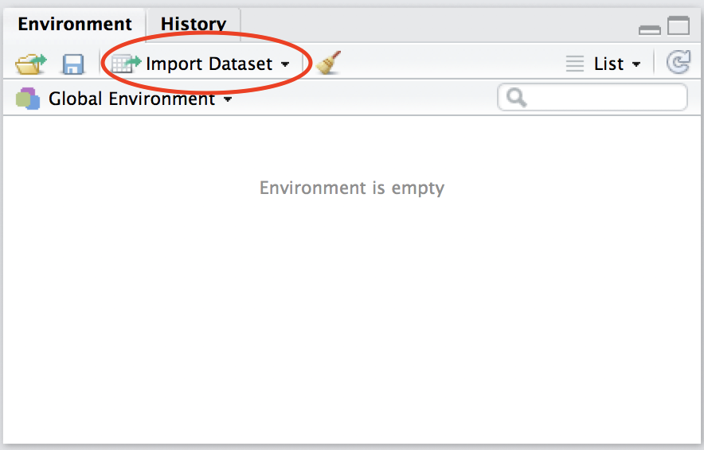
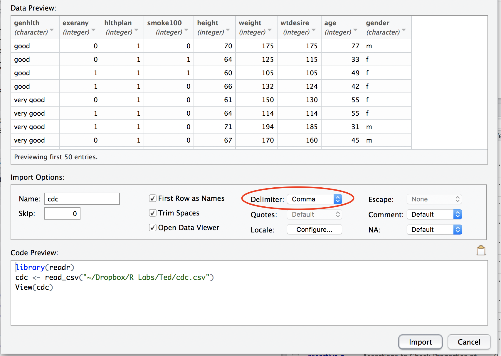

```{r setup, include=FALSE}
knitr::opts_chunk$set(echo=T, results='hide', message=FALSE, warning=FALSE)
require(tidyverse)
cdc <- read_csv("cdc.csv")
```

In this lab, we'll start to dig into some real data, and you'll answer some questions! Make a new R script to keep track of what we do.

The first thing we need to do to analyze data is to import it so that R knows what it is. R is pretty good at importing data from a lot of sources. It can import all types of files, but we'll primarily use files which have been uploaded to the web to import. 
<!-- (You can also download these files and import them from your computer - ask about this if you're interested.) -->

You can go to https://www.cdc.gov/brfss/ to learn more about the data set we will be analyzing.

The Behavioral Risk Factor Surveillance System (BRFSS) is an annual telephone survey of 350,000 people in the United States. As its name implies, the BRFSS is designed to identify risk factors in the adult population and report emerging health trends. For example, respondents are asked about their diet and weekly physical activity, their HIV/AIDS status, possible tobacco use, and even their level of healthcare coverage. The BRFSS Web site (http://www.cdc.gov/brfss) contains a complete description of the survey, including the research questions that motivate the study and many interesting results derived from the data.

In the Environment/History window, you'll see a button that says "Import Dataset." 



Click on that, and choose `From CSV`.  A new window should pop up.  Choose `Browse` and type `cdc.csv` into the search box to find the file.  Then, click `Open`.  The first part of the data set will appear in the previewer.


The previewer should look reasonable. Before we import the data, let's spend some time looking at what's going on here. One thing to be on the lookout for is "First row as names." Often your files will contain your variable names as the first row. If this is the case (and it typically will be), this box should be checked. You should see a preview of your data show up as you load it. Take a look - think about how this data is organized. The imported data is called a "data frame."



There are several other Import Options.  Let's take a peek at the Delimiter option.  A delimiter is something that separates each single piece of datum (datum is the singular form of the word data).  RStudio chose `Comma` as the delimiter because the data file has the file extension `.csv` which stands for comma-separated values.

1. Click on the arrows in the delimiter option.  What are the other possible delimiter types that RStudio recognizes?  How does the data preview change when you select each of the other delimiters?  How do you know that you have the correct delimiter (based on the data preview)?

At the bottom left of the screen you will see a place to name your imported data. It is defaulting to `cdc` since that's the name of the file on the web. We'll keep that. Now let's go ahead and import the data into RStudio. Click `Import`.

## Inspecting the data

A preview of the dataset should open in a tab in the Editor.  If this did not happen, you can click the word `cdc` in the pane at the top right - this will open a preview of the dataset.

At the bottom of the window you'll see some information about the size of this data frame.  Describe the data set.

2. What do you notice about this data frame? 
<!-- How do you think the data frame was constructed?  -->

3. What do each of the columns represent? What do each of the rows represent?

4. How many variables are in this data set? How many cases?

5. Which variables are quantitative variables?  Report the unit of measurement for each variable.

6. Which variables are categorical variables?

### Numerical Summaries

One strength of R is that you can have multiple data frames imported at the same time. This flexibility means that you need to make sure you tell R which dataset you're working with (because you might have the same name for variables in multiple data sets).

#### Summarize

Let's say we want to find the mean height for everyone in the cdc dataset. This command is going to look long for such a simple task, but we'll see that we can do a lot with commands like this. The first part of the command tells R that we're using the cdc dataset. The summarize command tells R we want to summarize our data. Inside the summarize command, avg.height is what we want to call the mean of the height variable.

```{r}
cdc %>% 
  summarize(avg.height = mean(height))
```

Take a look at the output - we get a table with the average of all the heights. The `%>%` symbol is called the pipe - you can think of it like "and then", or "goes into", so you take the cdc dataset, and then you summarize it.

We could also get a few different mean averages in the same table:

```{r}
cdc %>% 
  summarize(avg.height = mean(height), avg.weight = mean(weight))
```

We can also get standard deviations instead of mean averages:

```{r}
cdc %>% 
  summarize(sd.height = sd(height), sd.weight=sd(weight))
```

Here are some commands you might find helpful: mean(), sd(), var(), min(), max(), sum(), IQR(), and n() - n() just counts the sample size.

7. Collect at least four summaries of the data, and describe in words what this information tells you.

* * *

## On your own

<!--
* Check that the "stats" package has been installed.  This package has a lot of useful functions, and you'll use some of them now.  Once the package is installed, be sure to check the box next to "stats" in the `Packages` tab so that you can use its functions.
-->


* Calculate the median weight and height, and compare these to the means (i.e., which is higher?).

* Make a histogram of the weights and heights.  Which measure of center may be more appropriate for weights? for heights?  Explain your rationale.

* The Body Mass Index (BMI) is a statistic calculated from the weight (in kg) and height (in cm) using the formula BMI= weight/(height^2).  Or, using the appropriate conversions, the BMI can be calculated from weight (in pounds) and height (in inches) using the formula BMI= 703*weight/(height^2).  You can learn more about the BMI at https://www.cdc.gov/healthyweight/assessing/bmi/index.html.   
Plot a histogram of the BMI for the people in this data set.  Calculate the center and spread of the BMI.  Describe, using appropriate numbers, its center and spread.  Describe the shape of this distribution.  Are there any unusual features?  Do you think a bell-shaped curve would be a good model for this distribution?  Explain your reasoning.

<div id="license">
This is a product of OpenIntro that is released under a [Creative Commons 
Attribution-ShareAlike 3.0 Unported](http://creativecommons.org/licenses/by-sa/3.0).
This lab was written for OpenIntro by Andrew Bray and Mine &Ccedil;etinkaya-Rundel. Modified by Ted Galanthay and Matt Thomas, August 2018.
</div>
